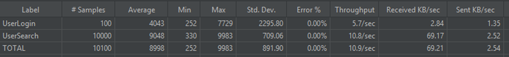
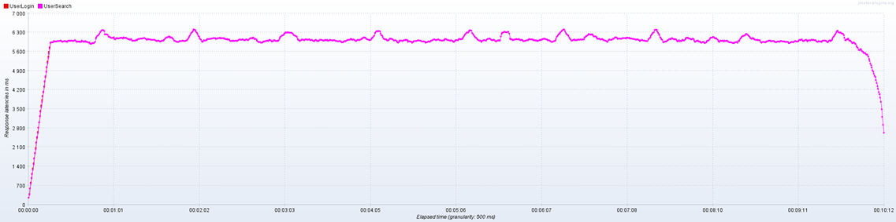

# Производительность индексов
### Разработанные методы:
- `user/search`  с авторизацией Cookie

## Тестирование производительности с индексом и без

* генерация тестовых данных командой `docker-compose exec php php cli.php app:fillingUsers`
* [сценарий(jmeter) для создания нагрузки](file/HighloadTesting.jmx).   
Необходимы установленные дополнительные плагины для Jmeter `graphs-additional-2.0`
* Создание индексов
  `docker-compose exec php php cli.php app:createIndex`
* Удаление индексов
`docker-compose exec php php cli.php app:deleteIndex`

## Методология тестирования
* при тестировании приложения, бд и создаваемая нагрузка находятся на разных машинах
* нагрузка создается при помощи приложения jmeter.
    * Приложение отправляет запросы на поиск по имени и фамилии
* тестирование проводится в 4 этапа
    * в 1 поток
    * в 10 потоков
    * в 100 потоков
    * в 1000 потоков
* после создания индекса для оптимизации поиска тесты повторяются
* после каждого замера приложение и бд перезапускаются

Sql-запрос
````
select user_id, name, surname, lastname, gender, biography, city 
from users
where
lower(name) like 'ольг%'
and lower(surname) like 'каз%'
````
 
##  Без индекса
Exlplain

### 1. Этап.  
   - Поток: 1
   - Количество запросов: 100
 
#### _Latency_

### _Throughput_

### _Summary_

___
### 2. Этап.  
   - Поток: 10
   - Количество запросов: 100
 
#### _Latency_

### _Throughput_

### _Summary_

___
### 3. Этап.  
   - Поток: 100
   - Количество запросов: 100
 
#### _Latency_

### _Throughput_

### _Summary_

___
### 4. Этап.  
   - Поток: 1000
   - Количество запросов: 1

Загрузка в момент нагрузки.

#### _Latency_

### _Throughput_

### _Summary_


___

## Создаём индекс для оптимизации запроса поиска
>CREATE INDEX idx_users_name_surname ON users USING btree (lower("name") varchar_pattern_ops,lower(surname) varchar_pattern_ops);
##  С индексом
Exlplain
### 1. Этап.
- Поток: 1
- Количество запросов: 100

#### _Latency_

### _Throughput_

### _Summary_

___
### 2. Этап.
- Поток: 10
- Количество запросов: 100

#### _Latency_

### _Throughput_

### _Summary_

___
### 3. Этап.
- Поток: 100
- Количество запросов: 100

#### _Latency_

### _Throughput_

### _Summary_

___
### 4. Этап.
- Поток: 1000
- Количество запросов: 1

#### _Latency_

### _Throughput_

### _Summary_

