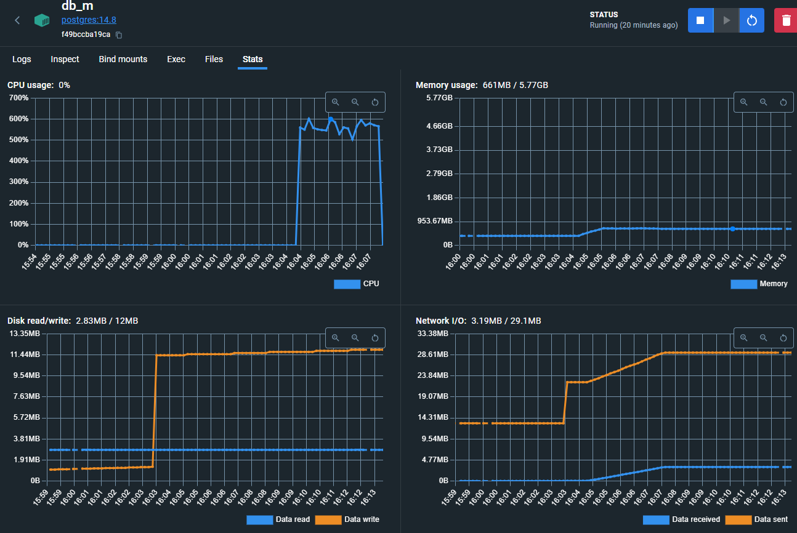
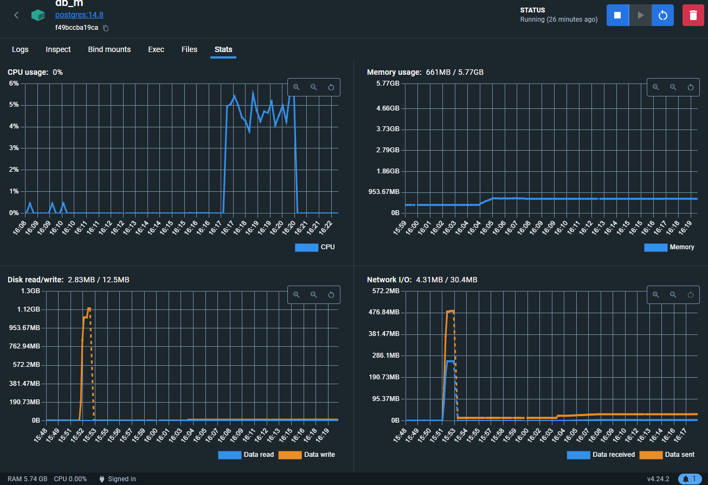

# 3. Полусинхронная репликация
## 1. Настройка асинхронной репликации
### - Настройка Мастера
При построении контейнера добавлена конфигурация для мастера (db_m)  
**a.) pg_hba.conf**  
>host replication replication_user 172.25.0.0/16  md5

**б.) postgresql.conf**
>ssl = off  
>wal_level = replica  
>max_wal_senders = 2  
>max_replication_slots = 2  
>hot_standby = on  
>hot_standby_feedback = on  
 
**в.)** Создание пользователя репликации `replication_user` и назначения соотвествующих прав.

После запуска контейнеров СУБД и приложения, выполнена команда создания резервной копии узла:
>docker exec -ti db_m su postgres -c "pg_basebackup --username=replication_user --pgdata=/tmp/pgslave --wal-method=stream --write-recovery-conf" 
###  - Настройка реплики
Так же был добавлен новый контейнер для реплики `db_s1`

Для восстановления на реплике, бэкап был скопированс мастера в локальную папку и 
после остановки реплики скопирован в его контейнер.
>docker cp db_m:/tmp/pgslave pgslave  
>docker cp pgslave/. db_s1:/var/lib/postgresql/data/.

В файле postgresql.auto.conf были обновлены настройки подключения к мастеру:
>primary_conninfo = 'user=replication_user host=db_m port=5432 password=password application_name=walreceiver channel_binding=prefer sslmode=prefer sslcompression=0 sslsni=1 ssl_min_protocol_version=TLSv1.2 gssencmode=prefer krbsrvname=postgres target_session_attrs=any'

Настройка закончена. 

## 2. Переключение запросов с мастера на реплику.
В код был внесены необходимые изменения для переключения запросов `/user/get/{id}` и `/user/search` на реплику. 
## 3. Проводим нагрузочные тесты.
 - Нагрузка на мастер до переключения. 
  
 - Нагрузка на местер после переключения.
  

## 4.,5. Настройка второго слейва и настройка синхронную репликацию.
Slave для синхронной репликации создавался аналогично с первым, кроме:
 - В файле второго slave заменяем в файле `postgresql.auto.conf` 
>primary_conninfo = 'user=replication_user host=db_m port=5432 password=password application_name=walreceiversync channel_binding=prefer sslmode=prefer sslcompression=0 sslsni=1 ssl_min_protocol_version=TLSv1.2 gssencmode=prefer krbsrvname=postgres target_session_attrs=any'
 - В файле postgresql.conf мастера была сделана настройка:
>synchronous_commit = on
>synchronous_standby_names = 'FIRST 1 (walreceiversync, walreceiver)'

## 6. Создаём нагрузку на запись в таблицу `users`
Нагрузка на запись создавал путем запуска скрипта
>docker-compose exec php php cli.php app:fillingUsers 1000000

Через некоторое время после запуска контейнер мастера был «убит»:

>docker kill --signal=SIGKILL db_m

При проверке выяснилось что в реплики все данные сохранились без потерь.

## Промоут одной из реплик

Подключился к синхронной реплике:
>docker exec -it db_s2 su - postgres -c psql

И выполнил команду:
>select * from pg_promote();

После изменил в файле `postgresql.conf` параметры:
>synchronous_commit = on 
>synchronous_standby_names = 'ANY 1 (db_m, walreceiver)'

И выполнил команду:
>select * from pg_reload_conf();
